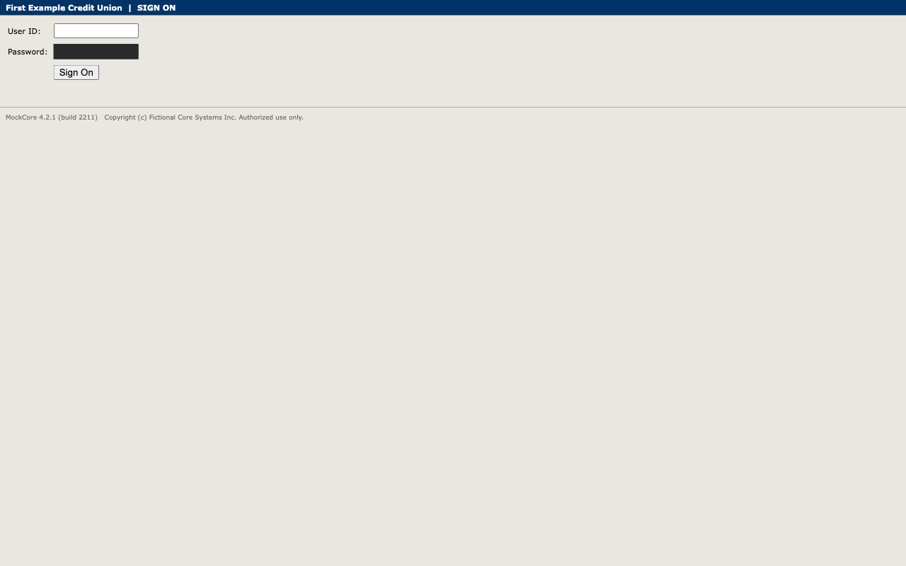
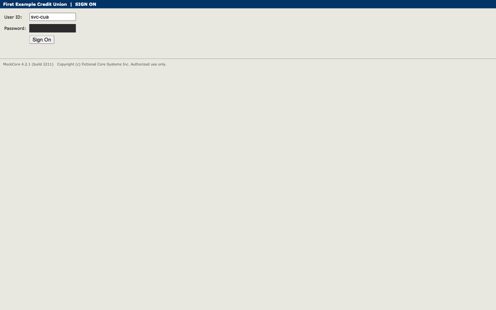
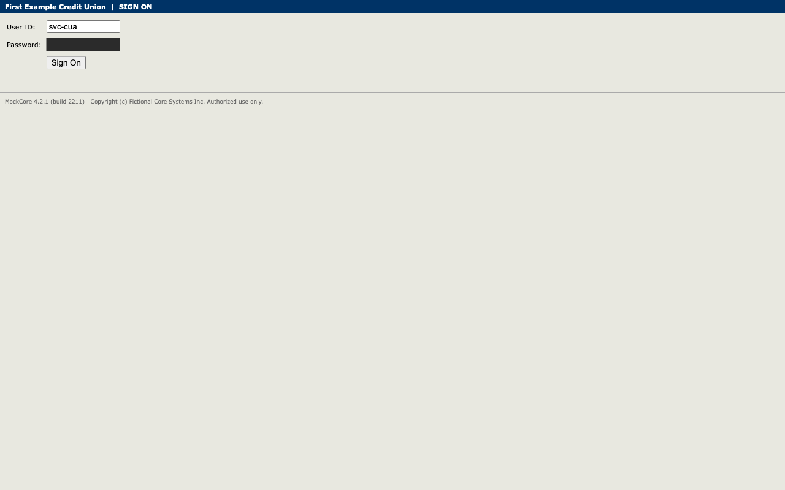
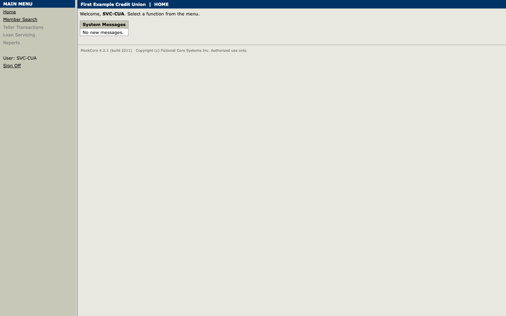

# Run report — `disc-20261003T033622-82ef`

| | |
|---|---|
| Mode | discovery |
| Goal | Look up member ***45 and read their current savings balance |
| Capability id | member.read_savings_balance |
| Model | gemini-3.8-flash |
| Status | **succeeded** |
| Summary | Member {{inputs.member_id}} (Jane Q Sample) was located, and the current savings balance of *******33 was extracted. |
| Agent steps recorded | 5 |
| Tokens | {'input_tokens': '[SECRET]', 'output_tokens': '[SECRET]'} |
| Duration | 161.8 s |
| Evidence | [`events.jsonl`](events.jsonl) · `screenshots/` · [`trace.json`](trace.json) |

## Timeline

| # | t | who | what | step | detail | screen |
|---|---|---|---|---|---|---|
| 1 | 0.0s | system | Run started (discovery) |  | member.read_savings_balance goal: Look up member ***45 and read their current savings balance |  |
| 2 | 0.0s | automation | Required capability started |  | mockcore/session.sign_on@1.0.0 |  |
| 3 | 0.2s | automation | Step completed | open_sign_on | Open the sign-on page |  |
| 4 | 0.4s | automation | Step completed | enter_user_id | Enter the service-account user id (located via anchor) |  |
| 5 | 0.6s | automation | Step completed | enter_password | Enter the service-account password (located via anchor) |  |
| 6 | 0.9s | automation | Step completed | submit | Submit the sign-on form (located via role) |  |
| 7 | 0.9s | automation | Required capability success |  | mockcore/session.sign_on@1.0.0 |  |
| 8 | 4.1s | agent | Model chose `click` e2 |  | Click Member Search to look up member ***45 |  |
| 9 | 15.2s | agent | Model chose `fill` e9 |  | Enter member ID ***45 in Member ID field |  |
| 10 | 18.0s | agent | Model chose `click` e11 |  | Click Search button to find member ***45 |  |
| 11 | 20.1s | agent | Model chose `click` e13 |  | Click member link ***45 to view details |  |
| 12 | 158.8s | agent | Model chose `extract` e28 |  | Extract current balance of Share Savings account |  |
| 13 | 158.9s | automation | Extracted `savings_balance` | 4 | {'amount': '*****33', 'currency': 'USD'} |  |
| 14 | 161.8s | agent | Model chose `finish` |  | Successfully looked up member ***45 and extracted the savings balance |  |
| 15 | 161.8s | system | Run finished: **succeeded** |  | Member ***45 (Jane Q Sample) was located, and the current savings balance of *******33 was extracted. |  |

_Generated from `events.jsonl` by `cua report`; the log is the source of truth._
