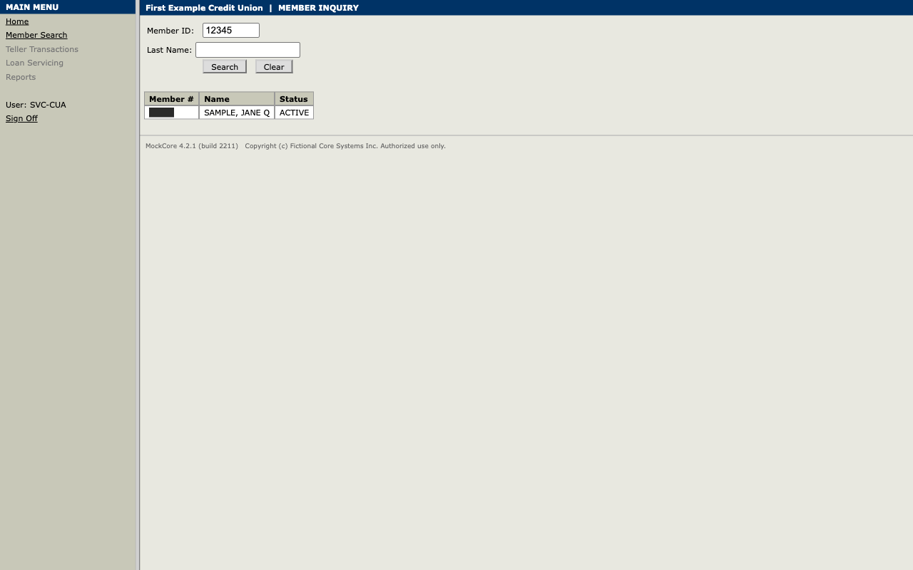
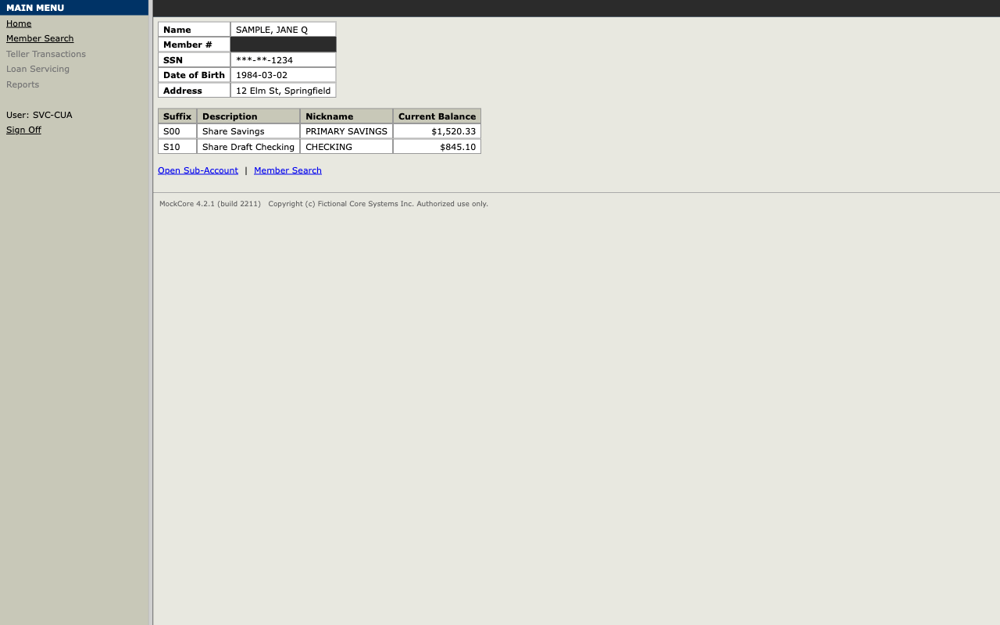
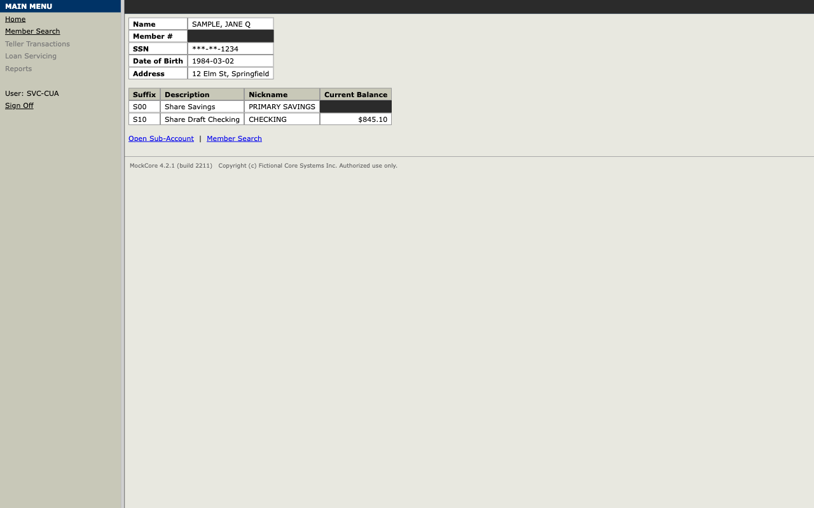

# Run report — `run-20261003T040359-6d2b`

| | |
|---|---|
| Mode | replay |
| Capability | mockcore/member.read_savings_balance@1.1.0 |
| Content hash | `sha256:e68a02aabedfb5bc8efe00fc675018e079028fabab1dfdbc2459bef4f0df174e` |
| Review status | draft |
| Status | **success** |
| Outputs | `{"savings_balance": {"amount": "*****33", "currency": "USD"}}` |
| Duration | 34.3 s |
| Evidence | [`events.jsonl`](events.jsonl) · `screenshots/` · [`result.json`](result.json) |

## Recoveries, drift and interventions

- Human intervention `hlp-20261003T040414-789e`

## Timeline

| # | t | who | what | step | detail | screen |
|---|---|---|---|---|---|---|
| 1 | 0.0s | system | Run started (replay) |  | mockcore/member.read_savings_balance@1.1.0 inputs: {'member_id': '***45'} |  |
| 2 | 0.0s | automation | Required capability started |  | mockcore/session.sign_on@1.0.0 |  |
| 3 | 0.2s | automation | Step completed | open_sign_on | Open the sign-on page |  |
| 4 | 0.4s | automation | Step completed | enter_user_id | Enter the service-account user id (located via anchor) |  |
| 5 | 0.6s | automation | Step completed | enter_password | Enter the service-account password (located via anchor) |  |
| 6 | 0.9s | automation | Step completed | submit | Submit the sign-on form (located via role) |  |
| 7 | 0.9s | automation | Required capability success |  | mockcore/session.sign_on@1.0.0 |  |
| 8 | 1.1s | automation | Step completed | open_member_search_link | Click Member Search to look up member {{inputs.member_id}} (located via role) |  |
| 9 | 1.3s | automation | Step completed | enter_member_id_field | Enter member ID {{inputs.member_id}} in Member ID field (located via anchor) |  |
| 10 | 13.9s | automation | Help requested | open_search_button | unknown_state: click could not be performed (not_actionable): Locator.click: Timeout 3000ms exceeded. |  |
| 11 | 13.9s | automation | Control: automation → paused |  | click could not be performed (not_actionable): Locator.click: Timeout 3000ms exceeded. |  |
| 12 | 18.1s | operator | Control: paused → human |  | operator took control |  |
| 13 | 22.9s | operator | Person clicked |  | 'Close' in main |  |
| 14 | 33.6s | operator | Control: human → automation |  | handed back: resume |  |
| 15 | 33.6s | operator | Handed back: resume |  | I closed the popup (1 recorded actions) |  |
| 16 | 33.9s | automation | Step completed | open_search_button | Click Search button to find member {{inputs.member_id}} (located via text) |  |
| 17 | 34.1s | automation | Step completed | open_member_id_link | Click member link {{inputs.member_id}} to view details (located via role) |  |
| 18 | 34.1s | automation | Extracted `savings_balance` | read_current_balance_value | {'amount': '*****33', 'currency': 'USD'} |  |
| 19 | 34.3s | automation | Step completed | read_current_balance_value | Extract current balance of Share Savings account (located via table_cell) |  |
| 20 | 34.3s | system | Run finished: **success** |  |  |  |

_Generated from `events.jsonl` by `cua report`; the log is the source of truth._
