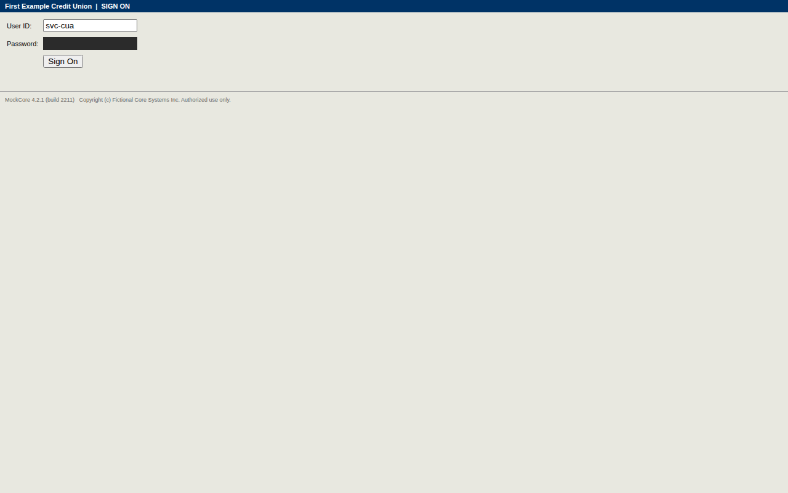
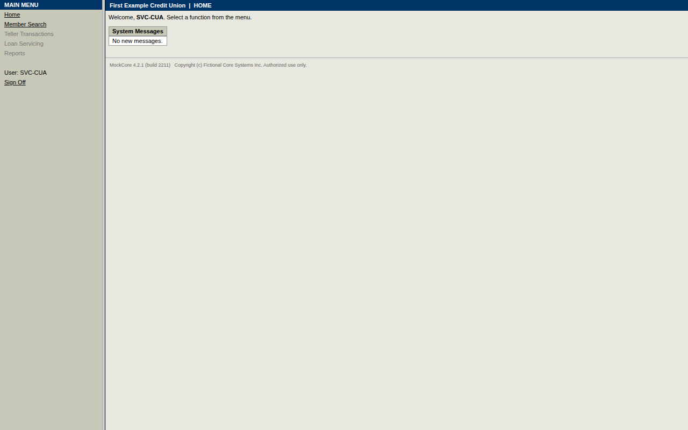
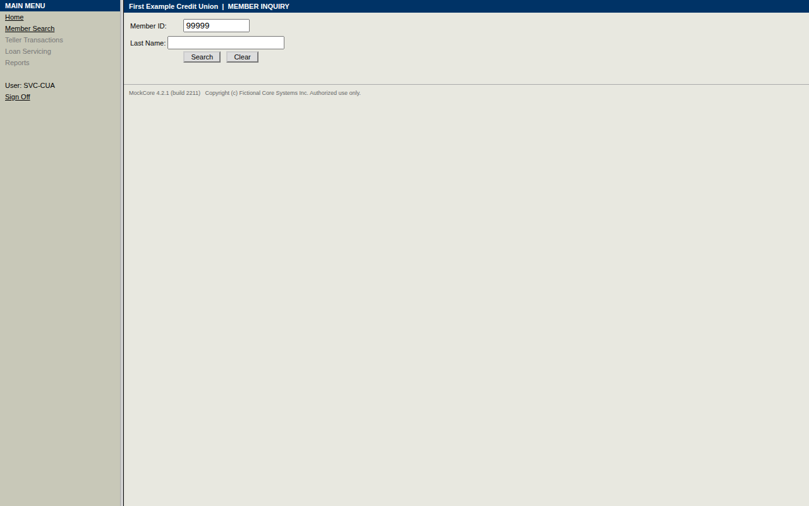

# Run report — `run-20261003T034630-3453`

| | |
|---|---|
| Mode | replay |
| Capability | mockcore/member.read_savings_balance@1.1.0 |
| Content hash | `sha256:e68a02aabedfb5bc8efe00fc675018e079028fabab1dfdbc2459bef4f0df174e` |
| Review status | draft |
| Status | **business_outcome** |
| Business outcome | `MEMBER_NOT_FOUND` — Searched for member ID {{inputs.member_id}} and received 'NO MEMBERS FOUND MATCHING SEARCH CRITERIA'. (from capability, step `open_search_button`) |
| Duration | 2.1 s |
| Evidence | [`events.jsonl`](events.jsonl) · `screenshots/` · [`result.json`](result.json) |

## Timeline

| # | t | who | what | step | detail | screen |
|---|---|---|---|---|---|---|
| 1 | 0.0s | system | Run started (replay) |  | mockcore/member.read_savings_balance@1.1.0 inputs: {'member_id': '***99'} |  |
| 2 | 0.0s | automation | Required capability started |  | mockcore/session.sign_on@1.0.0 |  |
| 3 | 0.3s | automation | Step completed | open_sign_on | Open the sign-on page |  |
| 4 | 0.6s | automation | Step completed | enter_user_id | Enter the service-account user id (located via anchor) |  |
| 5 | 0.8s | automation | Step completed | enter_password | Enter the service-account password (located via anchor) |  |
| 6 | 1.2s | automation | Step completed | submit | Submit the sign-on form (located via role) |  |
| 7 | 1.2s | automation | Required capability success |  | mockcore/session.sign_on@1.0.0 |  |
| 8 | 1.5s | automation | Step completed | open_member_search_link | Click Member Search to look up member {{inputs.member_id}} (located via role) |  |
| 9 | 1.8s | automation | Step completed | enter_member_id_field | Enter member ID {{inputs.member_id}} in Member ID field (located via anchor) |  |
| 10 | 2.1s | system | Run finished: **business_outcome** |  | MEMBER_NOT_FOUND |  |

_Generated from `events.jsonl` by `cua report`; the log is the source of truth._
