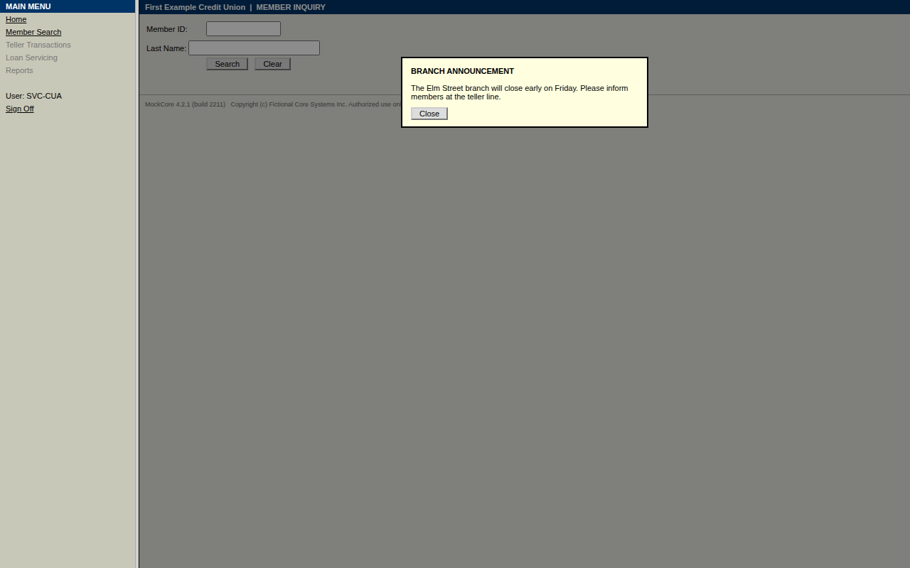
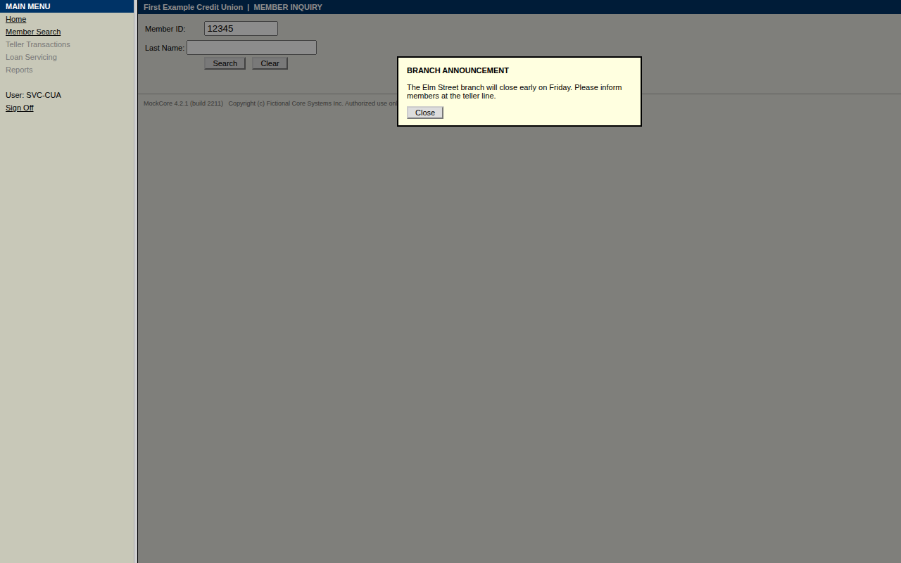

# Run report — `run-20261003T034731-f2d6`

| | |
|---|---|
| Mode | replay |
| Capability | mockcore/member.read_savings_balance@1.1.0 |
| Content hash | `sha256:e68a02aabedfb5bc8efe00fc675018e079028fabab1dfdbc2459bef4f0df174e` |
| Review status | draft |
| Status | **failed** |
| Error | `UNKNOWN_STATE` at step `open_search_button` — click could not be performed (not_actionable): Locator.click: Timeout 3000ms exceeded. |
| Duration | 15.1 s |
| Evidence | [`events.jsonl`](events.jsonl) · `screenshots/` · [`result.json`](result.json) |

## Failure detail

- **Category:** `UNKNOWN_STATE`
- **Step:** `open_search_button`
- **Expected:** click on an actionable element
- **Observed:** [nav] MAIN MENU Home Member Search Teller Transactions Loan Servicing Reports User: SVC-CUA Sign Off \| [main] First Example Credit Union \| MEMBER INQUIRY Member ID: Last Name: Search Clear MockCore 4.2.1 (build 2211) Copyright (c) Fictional Core Systems Inc. Authorized use only. BRANCH ANNOUNCEMENT The Elm Street branch will close early on Friday. Please inform members at the teller line. Close

## Timeline

| # | t | who | what | step | detail | screen |
|---|---|---|---|---|---|---|
| 1 | 0.0s | system | Run started (replay) |  | mockcore/member.read_savings_balance@1.1.0 inputs: {'member_id': '***45'} |  |
| 2 | 0.0s | automation | Required capability started |  | mockcore/session.sign_on@1.0.0 |  |
| 3 | 0.3s | automation | Step completed | open_sign_on | Open the sign-on page |  |
| 4 | 0.6s | automation | Step completed | enter_user_id | Enter the service-account user id (located via anchor) |  |
| 5 | 0.9s | automation | Step completed | enter_password | Enter the service-account password (located via anchor) |  |
| 6 | 1.3s | automation | Step completed | submit | Submit the sign-on form (located via role) |  |
| 7 | 1.3s | automation | Required capability success |  | mockcore/session.sign_on@1.0.0 |  |
| 8 | 1.7s | automation | Step completed | open_member_search_link | Click Member Search to look up member {{inputs.member_id}} (located via role) |  |
| 9 | 2.1s | automation | Step completed | enter_member_id_field | Enter member ID {{inputs.member_id}} in Member ID field (located via anchor) |  |
| 10 | 15.1s | system | Run finished: **failed** |  | UNKNOWN_STATE |  |

_Generated from `events.jsonl` by `cua report`; the log is the source of truth._
