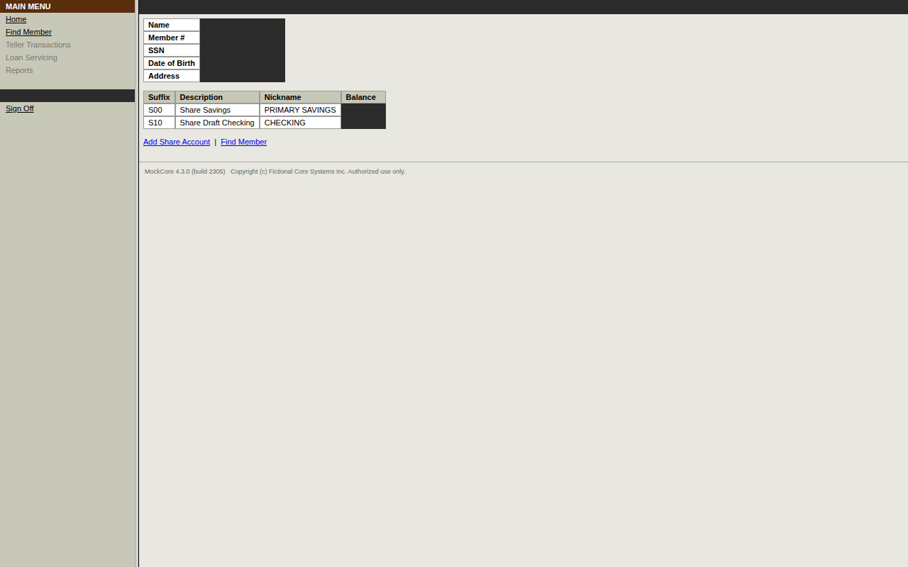
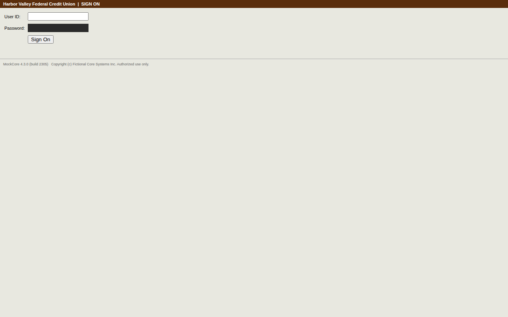
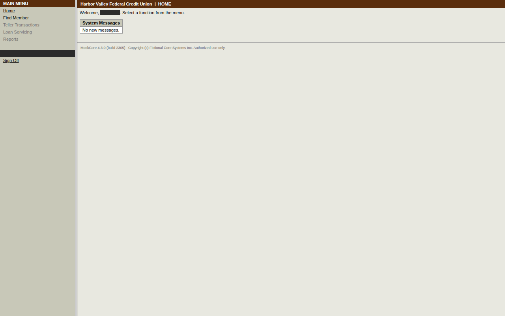

# Run report — `run-20261003T151907-af4a`

| | |
|---|---|
| Mode | replay |
| Capability | mockcore/member.read_savings_balance@1.1.0 |
| Content hash | `sha256:22e1679fe00d0bc13cff00020e282ab80526b44c1fbce6d42ede5585d6e74afb` |
| Review status | draft |
| Status | **failed** |
| Error | `CHECKPOINT_FAILED` at step `open_member_id_link` — step 'open_member_id_link' did not reach its expected state |
| Duration | 12.5 s |
| Evidence | [`events.jsonl`](events.jsonl) · `screenshots/` · [`result.json`](result.json) |

## Failure detail

- **Category:** `CHECKPOINT_FAILED`
- **Step:** `open_member_id_link`
- **Expected:** visible current_balance_value
- **Observed:** [nav] MAIN MENU Home Find Member Teller Transactions Loan Servicing Reports User: [SECRET] Sign Off \| [main] Harbor Valley Federal Credit Union \| MEMBER INQUIRY - ***45 Name [REDACTED] Member # [REDACTED] SSN [REDACTED] Date of Birth [REDACTED] Address [REDACTED] Suffix Description Nickname Balance S00 Share Savings PRIMARY SAVINGS [REDACTED] S10 Share Draft Checking CHECKING [REDACTED] Add Share Account \| Find Member MockCore 4.3.0 (build 2305) Copyright (c) Fictional Core Systems Inc. Authorized use only.

## Recoveries, drift and interventions

- Drift at step `open_member_search_link`: `member_search_link` resolved by fallback `attribute`
- Drift at step `enter_member_id_field`: `member_id_field` resolved by fallback `attribute`
- Drift at step `open_search_button`: `search_button` resolved by fallback `css`

## Timeline

| # | t | who | what | step | detail | screen |
|---|---|---|---|---|---|---|
| 1 | 0.0s | system | Run started (replay) |  | mockcore/member.read_savings_balance@1.1.0 inputs: {'member_id': '***45'} |  |
| 2 | 0.0s | automation | Required capability started |  | mockcore/session.sign_on@1.0.0 |  |
| 3 | 0.3s | automation | Step completed | open_sign_on | Open the sign-on page |  |
| 4 | 0.5s | automation | Step completed | enter_user_id | Enter the service-account user id (located via anchor) |  |
| 5 | 0.8s | automation | Step completed | enter_password | Enter the service-account password (located via anchor) |  |
| 6 | 1.1s | automation | Step completed | submit | Submit the sign-on form (located via role) |  |
| 7 | 1.1s | automation | Required capability success |  | mockcore/session.sign_on@1.0.0 |  |
| 8 | 1.1s | automation | Drift: fallback locator used | open_member_search_link | member_search_link via attribute (strategy #3) |  |
| 9 | 1.4s | automation | Step completed | open_member_search_link | Click Member Search to find member {{inputs.member_id}}. (located via attribute) |  |
| 10 | 1.4s | automation | Drift: fallback locator used | enter_member_id_field | member_id_field via attribute (strategy #2) |  |
| 11 | 1.7s | automation | Step completed | enter_member_id_field | Enter member ID {{inputs.member_id}} in the Member ID field. (located via attribute) |  |
| 12 | 1.7s | automation | Drift: fallback locator used | open_search_button | search_button via css (strategy #2) |  |
| 13 | 2.0s | automation | Step completed | open_search_button | Click Search button to find the member. (located via css) |  |
| 14 | 12.5s | system | Run finished: **failed** |  | CHECKPOINT_FAILED |  |

_Generated from `events.jsonl` by `cua report`; the log is the source of truth._
