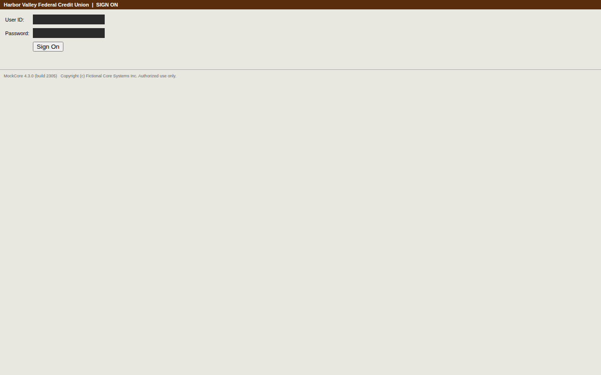
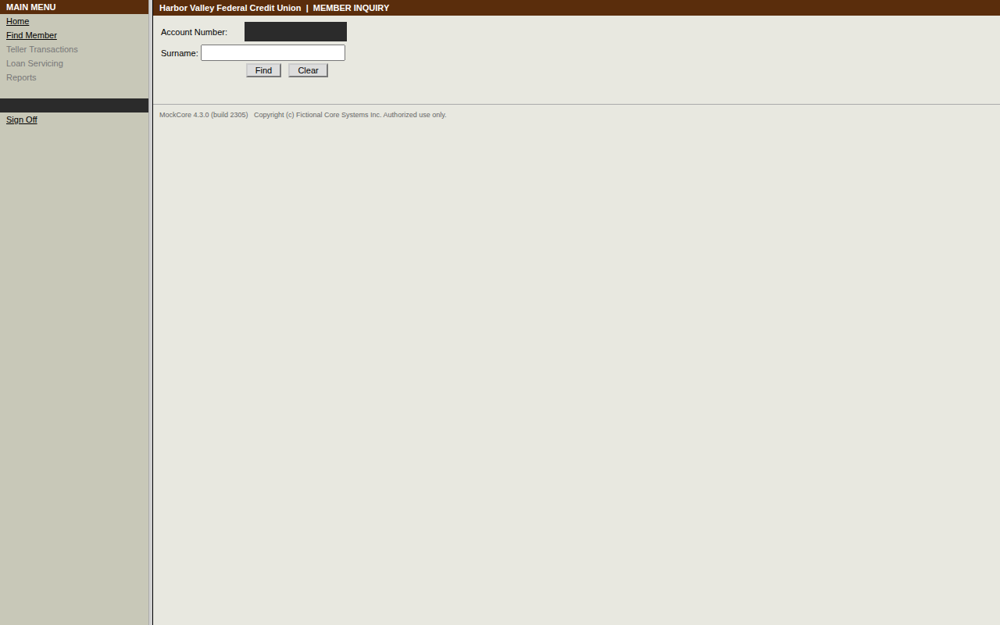
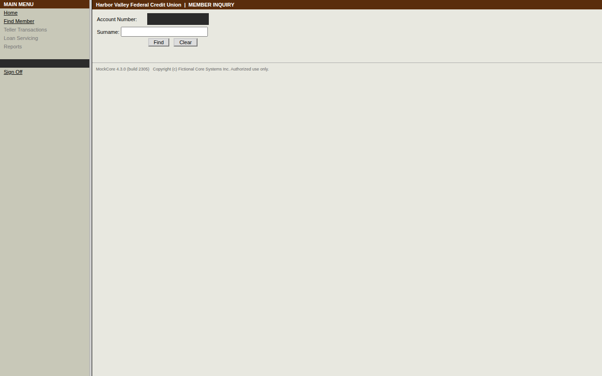
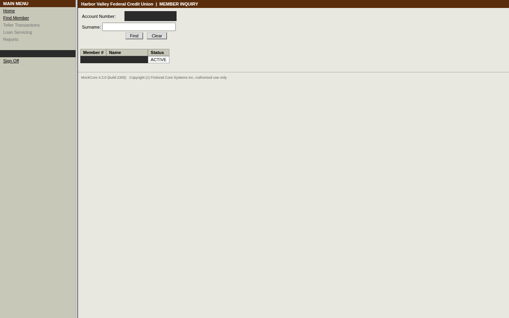
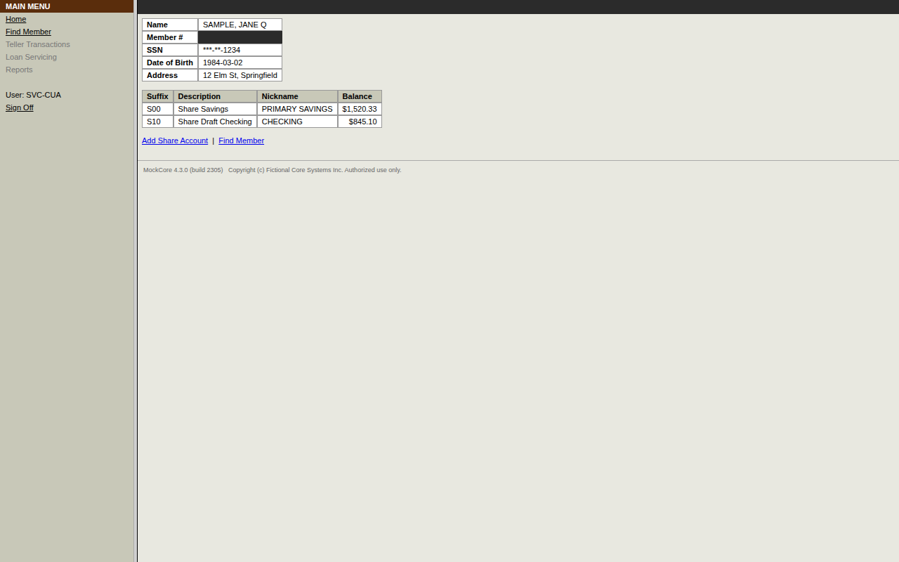
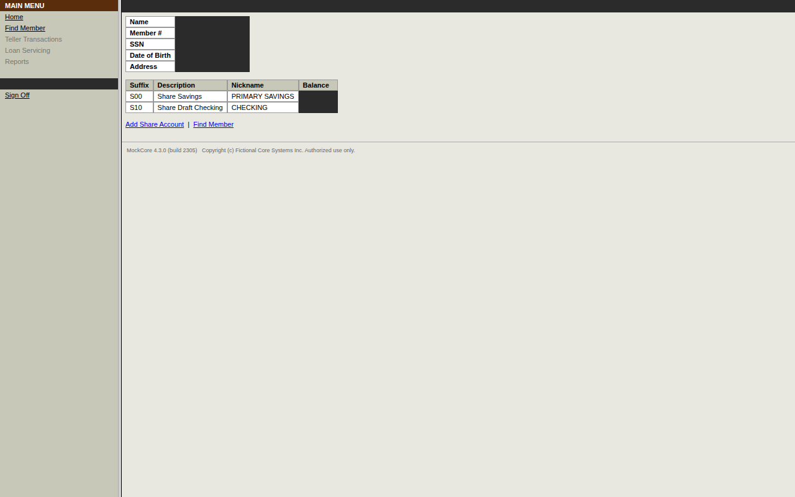

# Run report — `run-20261003T151920-9a50`

| | |
|---|---|
| Mode | replay |
| Capability | mockcore/member.read_savings_balance@1.1.0 |
| Content hash | `sha256:f217e84be3f6896dc4330d5a786884d95b9e28eb1745ad64e2dc7683f557d115` |
| Review status | draft |
| Status | **success** |
| Outputs | `{"savings_balance": {"amount": "*****33", "currency": "USD"}}` |
| Duration | 2.4 s |
| Evidence | [`events.jsonl`](events.jsonl) · `screenshots/` · [`result.json`](result.json) |

## Timeline

| # | t | who | what | step | detail | screen |
|---|---|---|---|---|---|---|
| 1 | 0.0s | system | Run started (replay) |  | mockcore/member.read_savings_balance@1.1.0 inputs: {'member_id': '***45'} |  |
| 2 | 0.0s | automation | Required capability started |  | mockcore/session.sign_on@1.0.0 |  |
| 3 | 0.3s | automation | Step completed | open_sign_on | Open the sign-on page |  |
| 4 | 0.5s | automation | Step completed | enter_user_id | Enter the service-account user id (located via anchor) |  |
| 5 | 0.7s | automation | Step completed | enter_password | Enter the service-account password (located via anchor) |  |
| 6 | 1.1s | automation | Step completed | submit | Submit the sign-on form (located via role) |  |
| 7 | 1.1s | automation | Required capability success |  | mockcore/session.sign_on@1.0.0 |  |
| 8 | 1.4s | automation | Step completed | open_member_search_link | Click Member Search to find member {{inputs.member_id}}. (located via role) |  |
| 9 | 1.6s | automation | Step completed | enter_member_id_field | Enter member ID {{inputs.member_id}} in the Member ID field. (located via anchor) |  |
| 10 | 1.9s | automation | Step completed | open_search_button | Click Search button to find the member. (located via text) |  |
| 11 | 2.2s | automation | Step completed | open_member_id_link | Click on the member ID to view details. (located via role) |  |
| 12 | 2.2s | automation | Extracted `savings_balance` | read_current_balance_value | {'amount': '*****33', 'currency': 'USD'} |  |
| 13 | 2.4s | automation | Step completed | read_current_balance_value | Extract the current balance of the member's Share Savings account. (located via table_cell) |  |
| 14 | 2.4s | system | Run finished: **success** |  |  |  |

_Generated from `events.jsonl` by `cua report`; the log is the source of truth._
